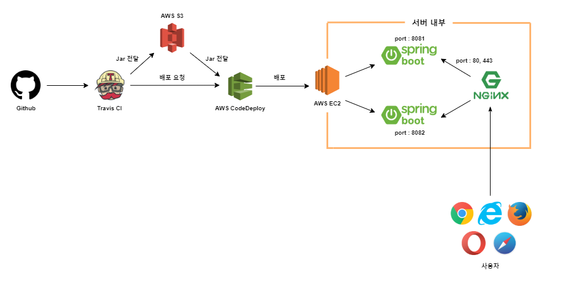

# board-springboot-webservice

목표
-----------
✅ **IntelliJ** 익숙해지기

✅ **JPA**를 이용해 CRUD 구현하기

✅ **AWS EC2**를 이용해 서버 환경 구축하기

✅ **AWS RDS**를 이용해 데이터베이스 구축하기

✅ **Travis CI**를 이용해 배포 자동화하기

✅ **nginx**를 이용해 무중단 배포 환경 구축하기  

Functions / 기능
-----------
- **회원**
  + 구글, 네이버 로그인
  + 로그인한 사용자 글 작성 권한
  + 본인 작성 글에 대한 권한 관리
  
- **게시판**
  + 게시글 조회
  + 게시글 등록
  + 게시글 수정
  + 게시글 삭제

Architecture / 구조
-----------

Acknowledgments / 감사의 말
-----------
'스프링 부트와 AWS로 혼자 구현하는 웹 서비스'의 저자 [이동욱](https://github.com/jojoldu)
